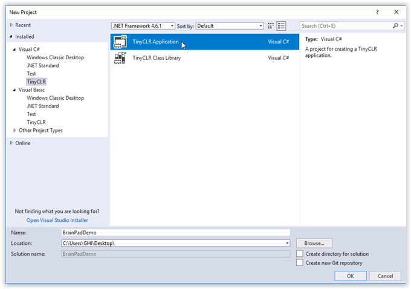
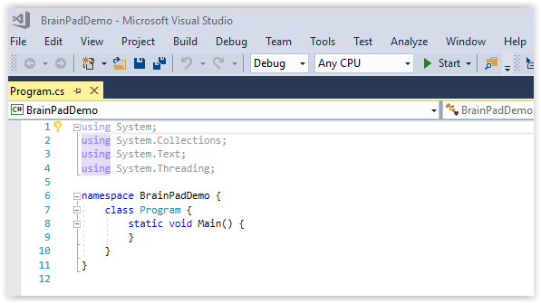
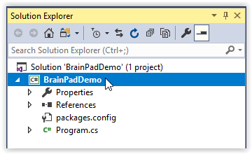
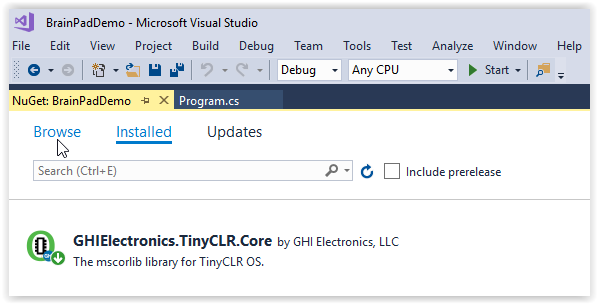
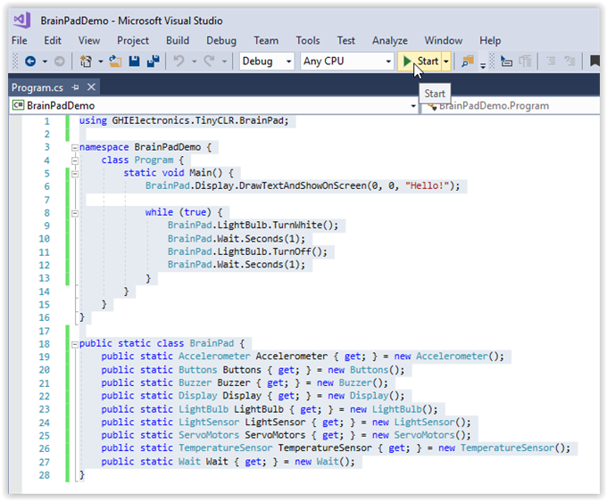

# Introduction to C# (C sharp)
---

**Mobile Friendly Menu**

* [Introduction](../intro.md)
* [System Setup](../system-setup.md)
* [Visual Basic](../vb/intro.md)
* [**C#**](intro.md)
* [Projects](../projects/intro.md)
* [Other Software](../other-software/intro.md)

---

It is not a secret that C and C++ are the most popular programming languages among professionals. This is particularly true for programmers that work with small digital systems.

C# is the modern cousin of the C and C++ family. Its syntax is very close to JAVA, another very popular programming language.

## Before you start
You should have already installed Visual Studio on your computer as well as the TinyCLR extension.  If not, please start with [System Setup](../system-setup.md) for instructions on how to do so.

Also, you need a BrainPad and a micro USB cable to continue.  Plug the BrainPad into the USB port of your computer.  The red power light on the BrainPad should be on.

## Hello World
The first step is to write some very simple code to see if your BrainPad will respond when we try to program it.  This is usually called a "hello world" program.

### Start a New Project

Open Visual Studio.  In the `File` menu select `New` and then `Project` to open the `New Project` dialog box.


In the left panel of the  `New Project` window (see below) you can click on the small triangles to the left of each heading to expand the heading and show the options beneath it.

You should see the `Visual C#` language listed under the `Installed` heading in the left panel of the `New Project` window.

Under `Visual C#` select the `TinyCLR` option.

In the center panel of the `New Project` window select `TinyCLR Application`.

At the bottom of the `New Project` window you can change the name and location of your application or just stick with the default.  When starting out you may wish to click on the `Browse` button and select the folder `Desktop` (in the left panel) to make your application easier to find.

Click the `OK` button on the bottom right of the `New Project` window.  This will create a new blank project.



Once created, you'll be presented with a `Program.cs` tab.



### Add the Code

In the `Program.cs` tab we will enter short sample program (our "Hello World" code). Cut and paste the following code into the `Program.cs` window.
```
using GHIElectronics.TinyCLR.BrainPad;

namespace BrainPadDemo {
    class Program {
        static void Main() {
            BrainPad.Display.DrawTextAndShowOnScreen(0, 0, "Hello!");

            while (true) {
                BrainPad.LightBulb.TurnWhite();
                BrainPad.Wait.Seconds(1);
                BrainPad.LightBulb.TurnOff();
                BrainPad.Wait.Seconds(1);
            }
        }
    }
}

public static class BrainPad {
    public static Accelerometer Accelerometer { get; } = new Accelerometer();
    public static Buttons Buttons { get; } = new Buttons();
    public static Buzzer Buzzer { get; } = new Buzzer();
    public static Display Display { get; } = new Display();
    public static LightBulb LightBulb { get; } = new LightBulb();
    public static LightSensor LightSensor { get; } = new LightSensor();
    public static ServoMotors ServoMotors { get; } = new ServoMotors();
    public static TemperatureSensor TemperatureSensor { get; } = new TemperatureSensor();
    public static Wait Wait { get; } = new Wait();
}
```

Your `Program.cs` window should look like this:


### Manage the NuGet Packages
C# source files are listed in the `Solution Explorer` window.  If the `Solution Explorer` window is not visible, click on `View > Solution Explorer` to open it.



The squiggly red lines under entries in the `Solution Explorer` window and `Program.cs` window indicate errors. In this case the errors are caused by missing Nuget packages. Let's tell Visual Studio to include the Nuget packages and fix that now.

If you right click on the project name in the Solution Explorer window a drop down menu will appear.  Select `Manage NuGet Packages...` from the menu.

 

Now you should see the installed TinyCLR NuGet library (GHIElectronics.TinyCLR.Core). We need to install a couple more libraries for our program to run.



Click on `Browse`.  You should see a list of available Nuget packages in your local feed.


Click on the `GHIElectronics.TinyCLR.BrainPad` package and then click on the `Install` button.


Installing the BrainPad Nuget package will automatically install the `GHIElectronics.TinyCLR.Devices` and `GHIElectronics.TinyCLR.Pins` packages as well. Click on `OK`.


Now accept the license agreement to install the packages.


Close the `NuGet...` tab to get back to your `Program.cs` window.  The red squiggles should now be gone.



### Deploy the Program
Make sure your device is plugged into the computer's USB port. Now hit the start button as shown in the above image (or hit the `F5` key). If you've done everything correctly the program will compile and deploy to your device. The message "Hello World!" should appear on the BrainPad display, and the light bulb should start blinking.

Congratulations! You're on your way to learning advanced programming on the BrainPad!

What happened exactly? Our application began by running the `BrainPad.Display.DrawTextAndShowOnScreen(0, 0, "Hello!")` line to instruct the display to show the text "Hello!"

The line `BrainPad.Display.DrawTextAndShowOnScreen(0, 0, "Hello!")` is known as a function call. The name of the function is "DrawTextAndShowOnScreen()." This function is part of the "Display" object, which is part of the "BrainPad" object.

The items listed in parenthesis (0, 0, "Hello!") are called the arguments of the function. In this case the first zero tells the BrainPad to display the text at the left side of the BrainPad display. If this number is increased the text will appear further to the right of the screen. The second zero tells the BrainPad to print the text at the top of the display. If this number is increased the text will be printed lower on the screen. The third arugument, "Hello!," tells the BrainPad what text to display on the screen.

After `BrainPadSetup()` is finished, the `While True` loop starts running. Code placed inside this while loop is executed in an infinite loop. This is why the code that turns the LED on and then off never stops.
