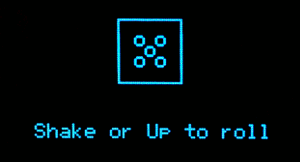

# Electronic Dice
---


You do not need a real dice. BrainPad Electronic Dice is a more fun, plus you can cheat by changing the program!

**Difficulty: Easy**

**Objective: Math**

## How It Works
A simple box is drawn to show the shape of a die. Then, we go in a loop generating random numbers and showing them as a die on the  display. Our loop has a an increasing delay giving a cool effect.

## The Code

```
using System;
using GHIElectronics.TinyCLR.BrainPad;

namespace Dice {
    class Program {
        const int DICE_BASE_X = 55;
        const int DICE_BASE_Y = 10;

        static void Main() {
            var Rnd = new Random();
            while (true) {
                BrainPad.Display.DrawSmallText(10, 55, "Shake or Up to roll");
                BrainPad.Display.DrawRectangle(DICE_BASE_X - 5, DICE_BASE_Y - 5, 31, 31);

                for (var i = 0; i < 100; i += 5) {
                    ShowDice(Rnd.Next(6) + 1);
                    BrainPad.Buzzer.Beep();
                    BrainPad.Wait.Milliseconds(i);
                    BrainPad.Display.ShowOnScreen();
                }
                while (BrainPad.Accelerometer.ReadX() < 1 && BrainPad.Buttons.IsUpPressed() == false) BrainPad.Wait.Minimum();
                BrainPad.Wait.Minimum();
            }
        }

        static void ShowDice(int num) {
            BrainPad.Display.ClearPartOfScreen(DICE_BASE_X + 3, DICE_BASE_Y + 3, 16, 16);

            switch (num) {
                case 1:
                    BrainPad.Display.DrawCircle(DICE_BASE_X + 10, DICE_BASE_Y + 10, 2);
                    break;

                case 2:
                    BrainPad.Display.DrawCircle(DICE_BASE_X + 5, DICE_BASE_Y + 5, 2);
                    BrainPad.Display.DrawCircle(DICE_BASE_X + 15, DICE_BASE_Y + 15, 2);
                    break;

                case 3:
                    BrainPad.Display.DrawCircle(DICE_BASE_X + 5, DICE_BASE_Y + 5, 2);
                    BrainPad.Display.DrawCircle(DICE_BASE_X + 10, DICE_BASE_Y + 10, 2);
                    BrainPad.Display.DrawCircle(DICE_BASE_X + 15, DICE_BASE_Y + 15, 2);
                    break;

                case 4:
                    BrainPad.Display.DrawCircle(DICE_BASE_X + 5, DICE_BASE_Y + 5, 2);
                    BrainPad.Display.DrawCircle(DICE_BASE_X + 5, DICE_BASE_Y + 15, 2);
                    BrainPad.Display.DrawCircle(DICE_BASE_X + 15, DICE_BASE_Y + 15, 2);
                    BrainPad.Display.DrawCircle(DICE_BASE_X + 15, DICE_BASE_Y + 5, 2);
                    break;

                case 5:
                    BrainPad.Display.DrawCircle(DICE_BASE_X + 5, DICE_BASE_Y + 5, 2);
                    BrainPad.Display.DrawCircle(DICE_BASE_X + 5, DICE_BASE_Y + 15, 2);
                    BrainPad.Display.DrawCircle(DICE_BASE_X + 15, DICE_BASE_Y + 15, 2);
                    BrainPad.Display.DrawCircle(DICE_BASE_X + 15, DICE_BASE_Y + 5, 2);
                    BrainPad.Display.DrawCircle(DICE_BASE_X + 10, DICE_BASE_Y + 10, 2);
                    break;

                case 6:
                    BrainPad.Display.DrawCircle(DICE_BASE_X + 5, DICE_BASE_Y + 5, 2);
                    BrainPad.Display.DrawCircle(DICE_BASE_X + 5, DICE_BASE_Y + 10, 2);
                    BrainPad.Display.DrawCircle(DICE_BASE_X + 5, DICE_BASE_Y + 15, 2);
                    BrainPad.Display.DrawCircle(DICE_BASE_X + 15, DICE_BASE_Y + 5, 2);
                    BrainPad.Display.DrawCircle(DICE_BASE_X + 15, DICE_BASE_Y + 10, 2);
                    BrainPad.Display.DrawCircle(DICE_BASE_X + 15, DICE_BASE_Y + 15, 2);
                    break;
            }
        }
    }

    public static class BrainPad {
        public static Accelerometer Accelerometer { get; } = new Accelerometer();
        public static Buttons Buttons { get; } = new Buttons();
        public static Buzzer Buzzer { get; } = new Buzzer();
        public static Display Display { get; } = new Display();
        public static LightBulb LightBulb { get; } = new LightBulb();
        public static LightSensor LightSensor { get; } = new LightSensor();
        public static ServoMotors ServoMotors { get; } = new ServoMotors();
        public static TemperatureSensor TemperatureSensor { get; } = new TemperatureSensor();
        public static Wait Wait { get; } = new Wait();
    }
}
```