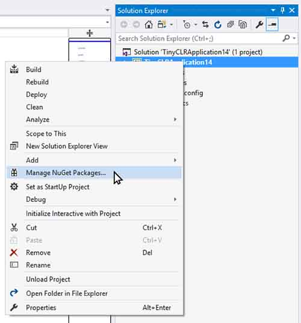
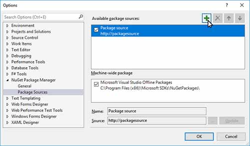
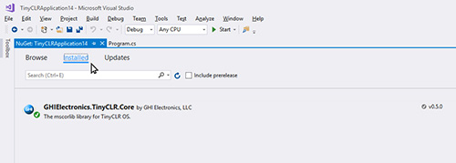
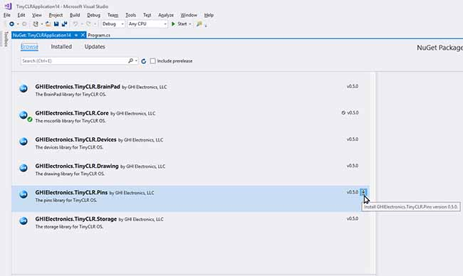
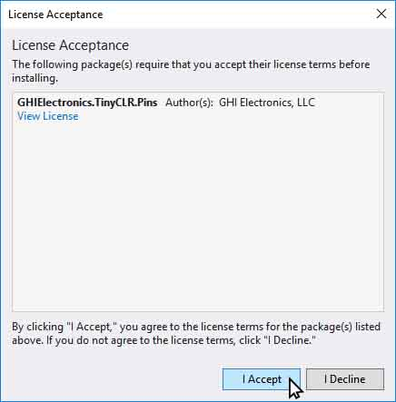

# System Setup
---
TinyCLR OS is the tiny operating system used by the BrainPad to run your C# and Visual Basic programs. Microsoft Visual Studio is used to write these programs on your computer and is also used by professional programmers the world over. Both TinyCLR and Visual Studio are available for free, but must be set up before using them to program the BrainPad and start having fun.

> [!Tip]
> You can learn more about TinyCLR OS on the [**GHI Electronics website**](https://www.ghielectronics.com/tinyclr/features)

## Step 1: Install the Necessary Software
---
### Visual Studio
The Visual Studio Community Edition is free and can be found here: [Microsoft Visual Studio 2017 Community Edition.](https://www.visualstudio.com/vs/community/)

[](https://www.visualstudio.com/vs/community/)

Click on the above link an then click on the **Download VS Community 2017** button. After downloading is complete, run the file. If you are asked, allow the program to make changes to your device.

When the installation program shows the `Workloads` screen, select `.NET desktop development` (you should see a check mark in the `.NET desktop development` box) and then click the `Install` button.


After installation is complete, click on the `Launch` button. You will be asked to sign in or sign up for Visual Studio developer services. You can either sign in (or sign up) now or click the 'Not now, maybe later' option. You will then be asked to pick a color scheme and Visual Studio will start.

### TinyCLR OS Project System.

If Visual Studio is open, close it before continuing with the TinyCLR installation.

Download the [TinyCLR Visual Studio Project System 0.10.0](http://files.ghielectronics.com/downloads/TinyCLR/Extensions/TinyCLR%20OS%20Project%20System%20v0.10.0.vsix). After the download is complete, click on the up arrow next to the download name at the bottom of the screen as shown below.


Then select `Open` from the pop-up menu.


In the `VSIX Installer` dialog box click the `Install` button.


### Download and Install the TinyCLR Nuget Packages

1. Since TinyCLR OS is still so new, we haven't yet uploaded any packages to NuGet.  Download the newest [libraries](downloads.md#libraries), extract the archive, and place them in a [local NuGet feed](https://docs.nuget.org/ndocs/hosting-packages/local-feeds).
2. Connect your device to your PC using a USB cable (make sure your device has the latest firmware installed).
3. Start Visual Studio and create a new `TinyCLR Application` under `C# > TinyCLR`. New to Visual Studio or C#? Take a look at the [getting started guide from Microsoft](https://docs.microsoft.com/en-us/dotnet/csharp/getting-started/with-visual-studio).
4. Right click on your Project in the Solution Explorer and select `Manage NuGet Packages`.  If the Solution Explorer window is not visible, open it by selecting `Solution Explorer` in the `View` menu.


5. Select the `Package Source` settings icon. 
 

6. Click the `+` button to add a new Package source. 


7. Select the location where the NuGet packages are stored locally, by pressing the `...` button. 


8. After Selecting the local folder where the downloaded NuGet packages are, you can select the `Installed` Tab to view the installed NuGet Packages. 


9. Selecting the `Browse` tab will show all the NuGet packages located in your local NuGet feed. Those installed are noted with a green check mark in front of the name. 


10. To install one of the packages click on the package name, click the check box to the right under "Version(s)," and click on the `Install` button.


11. Accept the licensing agreement to install the package.


And, that's it! You're now ready to start programming using TinyCLR OS.


## Step 2: Prepare the BrainPad
---

> [!Tip]
> If you have the original BrainPad Concept/Prototype the setup is slightly different. See the [**Older BrainPad**](..\resources\older-brainpad.md) page for more details.

To prepare the BrainPad you only need to install the latest firmware as described below.

1. Download and save the TinyCLR OS v0.10 firmware from [Downloads](../resources/downloads.md). We recommend saving the firmware file on your desktop.
2. Connect the BrainPad to your computer using a micro USB cable. The power (PWR) light on the BrainPad should be on.
3. Press and hold the RESET button on the BrainPad for at least three seconds until the Light Bulb on the BrainPad lights up green.
4. A window will open named `BrainPad2`. Drag the firmware file from step 1 into this window.
5. The Light Bulb on the BrainPad will flicker and a progress gauge will appear on the computer screen.
6. It only takes a few seconds for the firmware to be copied to the BrainPad. When it is done, the green light on the BrainPad will stop flickering and the `BrainPad2` window will close.
7. Congratulations! Your BrainPad is now running the latest firmware!


> [!Note]
> The BrainPad comes with a "bootloader" pre-installed. You shouldn't have to reinstall it unless you are an advanced user using advanced programming techniques. Check out our [**bootloader**](../resources/bootloader.md) page to find out more.

## Going Beyond!
Congratulations! You are now ready to start programming like a professional. You have the option of using the [C#](csharp/intro.md) programming language or the [Visual Basic](vb/intro.md) programming language. If you are not sure which one to pick, C# is used more often in the professional world and is recommended for those serious about learning programming. Visual Basic is easier to use -- especially for beginners. We use C# for our own software development, but we usually start with Visual Basic for those who are new to programming.

You are not locked in to one language -- you can freely switch between C# and Visual Basic.

To give you a better idea, here is code that counts from 1 to 10 on the BrainPad display in C#:

```
namespace Counter {
    class Program {
        public void Main() {
            for (int count = 1; count < 11; count++) {
                BrainPad.Display.DrawNumberAndShowOnScreen(0, 0, count);
                BrainPad.Wait.Seconds(1);
            }
        }
    }
}
```

And here is equivalent code in Visual Basic:
```
Class Program
    Public Sub Main()
        For count = 1 To 10
            BrainPad.Display.DrawNumberAndShowOnScreen(0, 0, count)
            BrainPad.Wait.Seconds(1)
        Next count
    End Sub
End Class
```

Click on a link below to get started:

* [C# Introducton](csharp/intro.md)
* [Visual Basic Introduction](vb/intro.md)


---
You are on the documentation website for the BrainPad. The main website is found at [www.brainpad.com](http://www.brainpad.com/)
