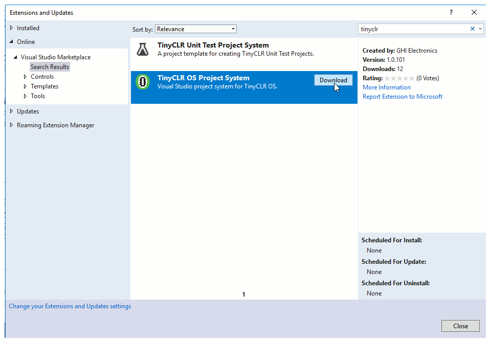
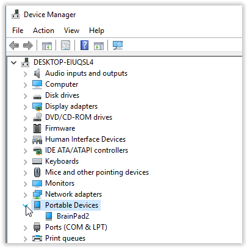

# System Setup
---
TinyCLR OS is the tiny operating system used by the BrainPad to run your C# and Visual Basic programs. Microsoft Visual Studio is used to write these programs on your computer and is also used by professional programmers the world over. Both TinyCLR and Visual Studio are available for free, but must be set up before you can program the BrainPad and start having fun.

This video details the instructions on this page.

<iframe width="560" height="315" src="https://www.youtube.com/embed/TDvHfaDPlWk" frameborder="0" allowfullscreen></iframe>


> [!Tip]
> You can learn more about TinyCLR OS on the [**GHI Electronics website**](https://www.ghielectronics.com/tinyclr/features)

## System Setup Overview
The instructions on this page describe how to setup your computer to start programming the BrainPad using Visual Studio. The steps are as follows:

**Step 1: Setup Your Computer**
  * [Install Visual Studio](#install-visual-studio).
  * [Install the TinyCLR Extension](#install-the-tinyclr-extension).

**Step 2: Setup Your BrainPad**
  * [Load the BrainPad TinyCLR OS Firmware](#load-the-brainpad-tinyclr-firmware).

---

## Step 1: Setup Your Computer
---

### Install Visual Studio
The Visual Studio Community Edition is free and can be found here: [Microsoft Visual Studio 2017 Community Edition.](https://www.visualstudio.com/vs/community/)

[](https://www.visualstudio.com/vs/community/)

Click on the above link an then click on the **Download VS Community 2017** button. After downloading is complete, open or run the file. If you are asked, allow the program to make changes to your device.

When the installation program shows the `Workloads` screen, select `.NET desktop development` (you should see a check mark in the `.NET desktop development` box) and then click the `Install` button.


After installation is complete, click on the `Launch` button. You will be asked to sign in or sign up for Visual Studio developer services. You can either sign in (or sign up) now or click the 'Not now, maybe later' option. You will then be asked to pick a color scheme and Visual Studio will start.

### Install the TinyCLR Extension

This project system extension allows Visual Studio to work with the BrainPad. To install, first run Visual Studio and then go to `Tools->Extensions and Updates...`. In the search box enter tinyclr and you should now be able to see the extension. Go ahead and install it.


> [!Tip]
> It is possible to download the extension seperately to install on a computer without internet access.

## Step 2: Setup Your BrainPad
---

### Load the BrainPad TinyCLR Firmware

The TinyCLR OS firmware is loaded the same way MakeCode programs are loaded.

1. Download the desired BrainPad TinyCLR OS firmware from [Downloads](../resources/downloads.md).
2. Select `Show in folder` or `Save` and `Open folder` (depending on your browser).
3. Connect the BrainPad to your computer using a micro USB cable. The power (PWR) light on the BrainPad should be on.
4. Press and hold the RESET button on the BrainPad for at least three seconds until the Light Bulb on the BrainPad lights up green.
5. Window will detect a media device named `BrainPad`. Copy or drag the firmware file from the folder in step 2 into this media.
6. The Light Bulb on the BrainPad will flicker and a progress gauge will appear on the computer screen.
7. It only takes a few seconds for the firmware to be copied to the BrainPad. When it is done, the green light on the BrainPad will stop flickering and the `BrainPad2` window will close.
8. Congratulations! Your BrainPad is now running TinyCLR OS.

While the BrainPad will seem to not do anything at this point, it is actually running TinyCLR OS and is waiting for Visual Studio. For verification, you can check under `device manager` to verify it is runnig TinyCLR OS.



> [!Note]
> The BrainPad comes with a "bootloader" pre-installed. You shouldn't have to reinstall it unless you are an advanced user using advanced programming techniques. Check out our [**bootloader**](../resources/bootloader.md) page to find out more.

## Ready... Steady... GoByond!
Congratulations! You are now ready to start programming like a professional. You have the option of using the [C#](csharp/intro.md) programming language or the [Visual Basic](vb/intro.md) programming language. If you are not sure which one to pick, C# is used more often in the professional world and is recommended for those serious about learning programming. Visual Basic is easier to use -- especially for beginners. We use C# for our own software development, but we usually start with Visual Basic for those who are new to programming.

You are not locked in to one language -- you can freely switch between C# and Visual Basic.

To give you a better idea, here is code that counts from 1 to 10 on the BrainPad display in C#:

```
namespace Counter {
    class Program {
        public void Main() {
            for (int count = 1; count < 11; count++) {
                BrainPad.Display.DrawNumber(0, 0, count);
                BrainPad.Display.RefreshScreen();
                BrainPad.Wait.Seconds(1);
            }
        }
    }
}
```

And here is the equivalent code in Visual Basic:
```
Class Program
    Public Sub Main()
        For count = 1 To 10
            BrainPad.Display.DrawNumber(0, 0, count)
            BrainPad.Display.RefreshScreen()
            BrainPad.Wait.Seconds(1)
        Next count
    End Sub
End Class
```

Click on a link below to get started:

* [C# Introducton](csharp/intro.md)
* [Visual Basic Introduction](vb/intro.md)
