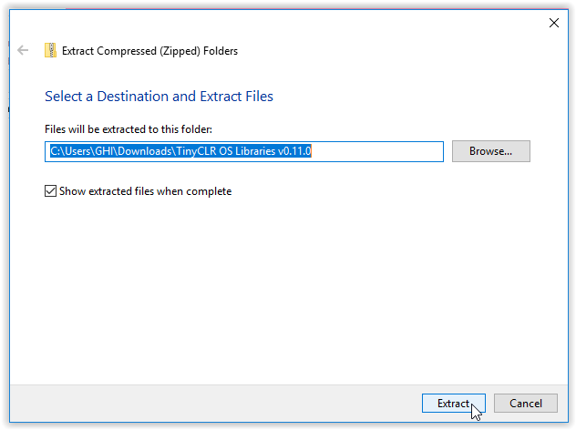
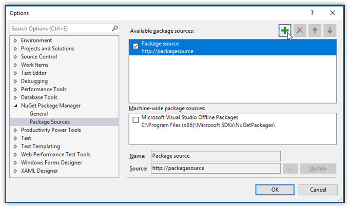

# System Setup
---
TinyCLR OS is the tiny operating system used by the BrainPad to run your C# and Visual Basic programs. Microsoft Visual Studio is used to write these programs on your computer and is also used by professional programmers the world over. Both TinyCLR and Visual Studio are available for free, but must be set up before using them to program the BrainPad to start having fun.

> [!Tip]
> You can learn more about TinyCLR OS on the [**GHI Electronics website**](https://www.ghielectronics.com/tinyclr/features)

## System Setup Overview
The instructions on this page describe how to setup your computer to start programming the BrainPad using Visual Studio. The steps are as follows:

**Step 1: Setup Your Computer**
  * [Install Visual Studio](#install-visual-studio).
  * [Install the TinyCLR Project System](#install-the-tinyclr-project-system).
  * [Install the TinyCLR NuGet packages](#install-the-tinyclr-nuget-packages).

**Step 2: Setup Your Brainpad**
  * [Install the BrainPad firmware](#install-the-brainpad-firmware).

---

## Step 1: Setup Your Computer
---
### Install Visual Studio
The Visual Studio Community Edition is free and can be found here: [Microsoft Visual Studio 2017 Community Edition.](https://www.visualstudio.com/vs/community/)

[](https://www.visualstudio.com/vs/community/)

Click on the above link an then click on the **Download VS Community 2017** button. After downloading is complete, open or run the file. If you are asked, allow the program to make changes to your device.

When the installation program shows the `Workloads` screen, select `.NET desktop development` (you should see a check mark in the `.NET desktop development` box) and then click the `Install` button.


After installation is complete, click on the `Launch` button. You will be asked to sign in or sign up for Visual Studio developer services. You can either sign in (or sign up) now or click the 'Not now, maybe later' option. You will then be asked to pick a color scheme and Visual Studio will start.

### Install the TinyCLR Project System

If Visual Studio is open, close it before continuing with the TinyCLR installation.

Download the TinyCLR [Visual Studio Project System](../resources/downloads.md#visual-studio-project-system) from our [Downloads](../resources/downloads.md) page.
[](../resources/downloads.md#visual-studio-project-system)

After the download is complete, open or run the downloaded file.

In the `VSIX Installer` dialog box click the `Install` button.


### Install the TinyCLR Nuget Packages

1. Since TinyCLR OS is still so new, we haven't yet uploaded any packages to NuGet. Click [here](../resources/downloads.md#nuget-libraries) and download the latest Nuget library.
[](../resources/downloads.md#nuget-libraries)

2. Open or run the downloaded file.

3. A window will pop up with a list of the files in the library. Click on the `Extract all` button.


4. A dialog box will appear allowing you to select a folder to save the files. You can change the folder location or accept the default location. You will need to remember the folder location for step 11. Click on the `Extract` button to extract and save the files.


5. If a window with the files appears, you can close it before continuing.

6. Start Visual Studio. From the `Tools` menu select `NuGet Package Manager` and then select `Package Manager Settings`.

7. In the left panel under `Nuget Package Manager` select `Package Sources`.

8. Click on the button with the green plus sign near the upper right corner of the `Options` dialog box. A new package source will be created in the `Available package sources` box.


9. Change the name of the package source from "package source" to "offline." You may have to click on the package source (in the available package sources box) before you can change the name.

10. Now change the folder name in the text box to the right of `Source:` to the folder where you saved the NuGet packages in step 5. You can either type in the folder name or click on the `...` button to search for the folder.

11. Click on the `Update` button. The folder name should now appear under the `offline` entry under `Available package sources`.

12. Click the `OK` button.
 

## Step 2: Setup Your BrainPad
---

> [!Tip]
> If you have an older concept or prototype BrainPad the setup is slightly different. See the [**Older BrainPads**](../resources/older-brainpad.md) page for more details.

### Install the BrainPad Firmware

To prepare the BrainPad you only need to install the latest firmware as described below.

1. Download the latest TinyCLR OS firmware for the BrainPad from [Downloads](../resources/downloads.md#tinyclr-os-brainpad-firmware).
2. Select `Show in folder` or `Save` and `Open folder` (depending on your browser).
3. Connect the BrainPad to your computer using a micro USB cable. The power (PWR) light on the BrainPad should be on.
4. Press and hold the RESET button on the BrainPad for at least three seconds until the Light Bulb on the BrainPad lights up green.
5. A window will open named `BrainPad2`. Copy or drag the firmware file from the folder in step 2 into this window.
6. The Light Bulb on the BrainPad will flicker and a progress gauge will appear on the computer screen.
7. It only takes a few seconds for the firmware to be copied to the BrainPad. When it is done, the green light on the BrainPad will stop flickering and the `BrainPad2` window will close.
8. Congratulations! Your BrainPad is now running the latest firmware!


> [!Note]
> The BrainPad comes with a "bootloader" pre-installed. You shouldn't have to reinstall it unless you are an advanced user using advanced programming techniques. Check out our [**bootloader**](../resources/bootloader.md) page to find out more.

## Going Beyond!
Congratulations! You are now ready to start programming like a professional. You have the option of using the [C#](csharp/intro.md) programming language or the [Visual Basic](vb/intro.md) programming language. If you are not sure which one to pick, C# is used more often in the professional world and is recommended for those serious about learning programming. Visual Basic is easier to use -- especially for beginners. We use C# for our own software development, but we usually start with Visual Basic for those who are new to programming.

You are not locked in to one language -- you can freely switch between C# and Visual Basic.

To give you a better idea, here is code that counts from 1 to 10 on the BrainPad display in C#:

```
namespace Counter {
    class Program {
        public void Main() {
            for (int count = 1; count < 11; count++) {
                BrainPad.Display.DrawNumber(0, 0, count);
                BrainPad.Display.RefreshScreen();
                BrainPad.Wait.Seconds(1);
            }
        }
    }
}
```

And here is the equivalent code in Visual Basic:
```
Class Program
    Public Sub Main()
        For count = 1 To 10
            BrainPad.Display.DrawNumber(0, 0, count)
            BrainPad.Display.RefreshScreen()
            BrainPad.Wait.Seconds(1)
        Next count
    End Sub
End Class
```

Click on a link below to get started:

* [C# Introducton](csharp/intro.md)
* [Visual Basic Introduction](vb/intro.md)


---
You are on the documentation website for the BrainPad. The main website is found at [www.brainpad.com](http://www.brainpad.com/)
