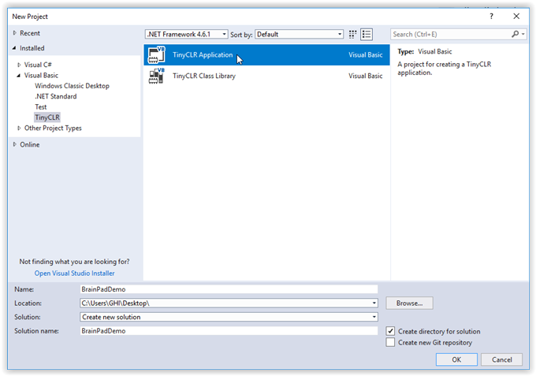
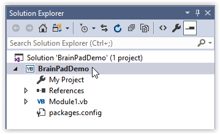
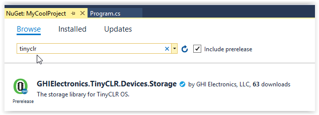
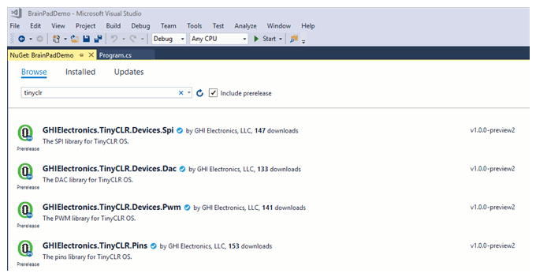
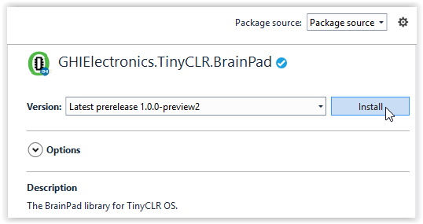
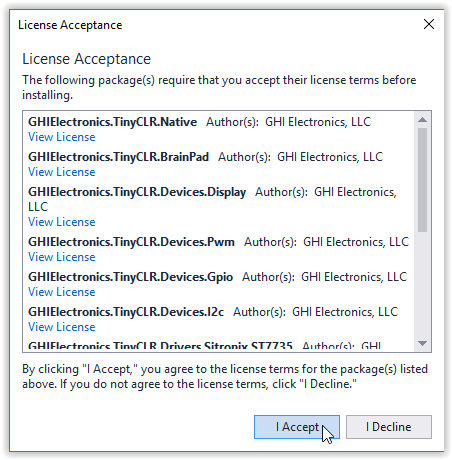
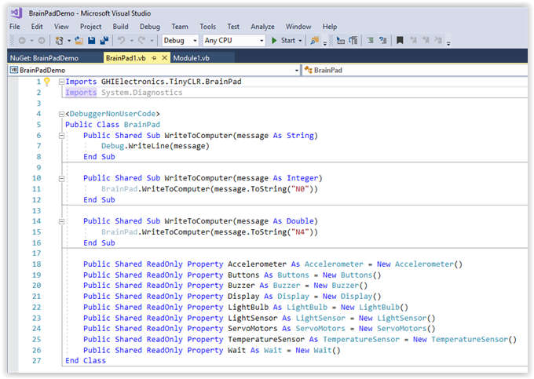
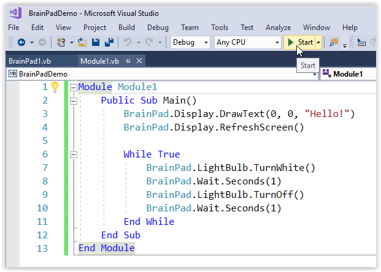

# Introduction to Visual Basic
---
Visual Basic is a very popular Microsoft .NET programming language. While being as powerful as other programming languages, it is perhaps a little easier for beginners.  Visual Basic is more like plain English than other programming languages, and you don't have to type a semicolon (;) at the end of each line like you do with C, C++, and C#.

## Visual Basic Introduction Overview
The instructions on this page describe how to run your first Visual Basic program (a "hello world" program) on the BrainPad. The steps are as follows:

  * [Start a new project](#start-a-new-project).
  * [Manage the NuGet packages](#manage-the-nuget-packages).
  * [Add the BrainPad helper code](#add-the-brainpad-helper-code).
  * [Add the sample program](#add-the-sample-program).
  * [Deploy the program](#deploy-the-program)

## Before you start
You should have already installed Visual Studio on your computer as well as the TinyCLR extension. If not, please start with [System Setup](../system-setup.md) for instructions on how to do so.

Also, you need a BrainPad and a micro USB cable to continue. Plug the BrainPad into the USB port of your computer. The red power (PWR) light on the BrainPad should be on.

## Hello World
The first step is to write some very simple code to see if the BrainPad will respond when we try to program it. This is usually called a "hello world" program.

### Start a New Project
Open Visual Studio.  In the `File` menu select `New` and then `Project` to open the `New Project` dialog box.


In the left panel of the `New Project` window (see below) you can click on the small triangles to the left of each heading to expand the heading and show the options beneath it.

You should see the `Visual Basic` language listed under the `Installed` heading in the left panel of the `New Project` window.

Under `Visual Basic` select the `TinyCLR` option.

In the center panel of the `New Project` window select `TinyCLR Application`.

At the bottom of the `New Project` window you can change the name and location of your application or just stick with the default. Let's use the name `BrainPadDemo`. When starting out you may wish to click on the `Browse` button and select the folder `Desktop` (in the left panel) to make your application easier to find.

Click the `OK` button on the bottom right of the `New Project` window.  This will create a new blank project.



Once created, you'll be presented with a `Module1.vb` tab.


### Manage the NuGet Packages
Code packages to handle specific tasks are built into libraries. These libraries are found on a cloud service, called NuGet. This is where you will find drivers for many things, including the sensors found on the BrainPad.

Soure files are listed in the `Solution Explorer` window. If the `Solution Explorer` window is not visible, click on `View > Solution Explorer` to open it.



If you right click on the project name in the Solution Explorer window a drop down menu will appear. Select `Manage NuGet Packages...` from the menu.

 

Now you should see the installed TinyCLR NuGet library (GHIElectronics.TinyCLR.Core). We need to install a couple more libraries for our program to run. Click on the `Browse` tab.


Make sure the package source is set to `Package source` or `All`.


In the search box type "tinyclr" and make sure the `Include prerelease` box is checked.



You should see a list of available TinyCLR Nuget packages similar to the image below.



Find and click on the `GHIElectronics.TinyCLR.BrainPad` package and then click on the `Install` button.



Installing the BrainPad Nuget package will automatically install other packages as well. Click on `OK`.


Now accept the license agreement to install the packages.



Close the `NuGet...` tab to get back to your `Program.cs` window.

### Add the BrainPad Helper Code

The BrainPad Helper code provides needed definitions for some BrainPad objects. To add this file to your program, select `Add New Item...` in the `Project` menu. Then in the `Add New Item` dialog box click on `BrainPad Helper` and then click on the `Add` button. You will see a tab labeled `BrainPad1.vb` with contents as shown below.



### Add the Sample Program  
In the `Module1.vb` tab we will enter short sample program (our "Hello World" code). Cut and paste the following code into the `Module1.vb` window.

```
Module Module1
    Public Sub Main()
        BrainPad.Display.DrawText(0, 0, "Hello!")
        BrainPad.Display.RefreshScreen()

        While True
            BrainPad.LightBulb.TurnWhite()
            BrainPad.Wait.Seconds(1)
            BrainPad.LightBulb.TurnOff()
            BrainPad.Wait.Seconds(1)
        End While
    End Sub
End Module
```

Your `Module1.vb` window should look like this:


### Deploy the Program
Make sure your BrainPad is plugged into the computer's USB port. Now hit the start button as shown in the above image (or hit the `F5` key). If you've done everything correctly the program will compile and deploy to your device. The message "Hello World!" should appear on the BrainPad display, and the light bulb should start blinking.

Congratulations! You're on your way to learning advanced programming on the BrainPad!

What happened exactly? Our application began by running the `BrainPad.Display.DrawText(0, 0, "Hello!")` and `BrainPad.Display.RefreshScreen()` lines to instruct the display to show the text "Hello!"

The line `BrainPad.Display.DrawText(0, 0, "Hello!")` is known as a function call. The name of the function is "DrawText()." This function is part of the "Display" object, which is part of the "BrainPad" object.

The items listed in parenthesis (0, 0, "Hello!") are called the arguments of the function. In this case the first zero tells the BrainPad to display the text at the left side of the BrainPad display. If this number is increased the text will appear farther to the right on the screen. The second zero tells the BrainPad to print the text at the top of the display. If this number is increased the text will be printed lower on the screen. The third arugument, "Hello!," tells the BrainPad what text to display on the screen.

After display lines are finished, the `While True` loop starts running. Code placed inside this while loop is executed in an infinite loop. This is why the LED keeps blinking and never stops.
